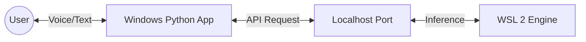

# 🤖 [Local-Hybrid-AI]

**[Nama-Project]** adalah jembatan (bridge) untuk membuat asisten AI pribadi yang berjalan **100% lokal**. Proyek ini menghubungkan kekuatan komputasi AI di **WSL 2** dengan antarmuka pengguna di **Windows**.

> **Konsep:** Backend (Otak) di Linux WSL + Frontend (Tubuh/Suara) di Windows.

## ⚡ Fitur

- 🔒 **Privasi Total:** Semua data diproses offline (localhost).
- 🚀 **Hybrid Architecture:** Memanfaatkan driver GPU Linux di WSL untuk performa model, namun tetap berinteraksi via Windows.
- 🗣️ **Voice Support:** Terintegrasi dengan Text-to-Speech (TTS) bawaan Windows.
- 🧩 **Modular:** Mendukung berbagai engine AI (Ollama, Llama.cpp, Text-Gen-WebUI).

## 🛠️ Arsitektur

Sistem bekerja melalui komunikasi HTTP Request via `localhost`.

1. WSL Side: Menjalankan Server LLM (misal: Ollama serve).

2. Windows Side: Script Python mengirim prompt user ke API WSL.

3. Output: Respon diterima Windows dan dibacakan/ditampilkan.

📋 Prasyarat
Sebelum memulai, pastikan kamu memiliki:

> Windows 10/11 dengan WSL 2 aktif.

> Python 3.x terinstall di Windows.

>  AI Engine di dalam WSL (Rekomendasi: Ollama).

🚀 Cara Instalasi
1. Siapkan Backend (Terminal WSL)
Jalankan server AI di WSL agar siap menerima request.

'''
# Contoh menggunakan Ollama
ollama pull llama3
ollama serve
'''
# Biarkan terminal ini terbuka

