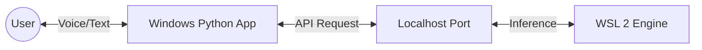

# 🤖 [Local-Hybrid-AI]


**[Nama-Project]** adalah jembatan (bridge) untuk membuat asisten AI pribadi yang berjalan **100% lokal**. Proyek ini menghubungkan kekuatan komputasi AI di **WSL 2** dengan antarmuka pengguna di **Windows**.

> **Konsep:** Backend (Otak) di Linux WSL + Frontend (Tubuh/Suara) di Windows.

## ⚡ Fitur

- 🔒 **Privasi Total:** Semua data diproses offline (localhost).
- 🚀 **Hybrid Architecture:** Memanfaatkan driver GPU Linux di WSL untuk performa model, namun tetap berinteraksi via Windows.
- 🗣️ **Voice Support:** Terintegrasi dengan Text-to-Speech (TTS) bawaan Windows.
- 🧩 **Modular:** Mendukung berbagai engine AI (Ollama, Llama.cpp, Text-Gen-WebUI).

## 🛠️ Arsitektur

Sistem bekerja melalui komunikasi HTTP Request via `localhost`.



1. WSL Side: Menjalankan Server LLM (misal: Ollama serve).

2. Windows Side: Script Python mengirim prompt user ke API WSL.

3. Output: Respon diterima Windows dan dibacakan/ditampilkan.

📋 Prasyarat
Sebelum memulai, pastikan kamu memiliki:

1. Windows 10/11 dengan WSL 2 aktif.

2. Python 3.x terinstall di Windows.

3.  AI Engine di dalam WSL (Rekomendasi: Ollama).


### 🚀 Cara Instalasi

1. Instalasi WSL
Jalankan perintah berikut di PowerShell (Run as Administrator):

```powershell
wsl --install
```

2. Instalasi Ollama
Jalankan perintah berikut di WSL (Run as Administrator):
```WSL
curl -fsSL https://ollama.com/install.sh | sh
```

3. Pilih Model
Rekomendasi:
Standar: 
```
ollama run llama3
```
Alternatif Ringan untuk RAM 8GB:
```
ollama run gemma:2b
```
Untuk PC (HIGH-End):
```
ollama run mistral
```

### 🪟 Setup (FrontEnd)
Sekarang, kita siapkan script Python di sisi Windows. Buka CMD atau PowerShell di folder project ini.

1. Clone Repository ini (jika belum)
```powerShell
git clone [https://github.com/OyenCar/Local-Hybrid-AI](https://github.com/OyenCar/Local-Hybrid-AI)
cd Local-Hybrid-AI
```

2. Install Library Python
Install Library
```
pip install -r requirements.txt
```

3. Jalankan OllamaMain.py
```
python .\OllamaMain.py
```
